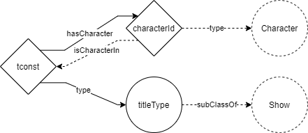

- [Inferences](#inferences)
  - [Properties](#properties)
    - [hasActor](#hasactor)
    - [hasLocation](#haslocation)
  - [Classes](#classes)
    - [Character](#character)
    - [Actor](#actor)
    - [Director](#director)
    - [Scene](#scene)
    - [Location](#location)
    - [Genre](#genre)
  - [Overview](#overview)

# Inferences

## Properties

### hasActor

```
ObjectProperty: hasActor   
    SubPropertyChain:
        hasCharacter o playedBy
```


### hasLocation

```
ObjectProperty: hasLocation   
    SubPropertyChain:
        hasScene o hasLocation
```

## Classes

It's important to understand that all classes will be inferred knowledge. Except for the specific title/show. These will be the only individuals which are explicitly stated to be of a class.

So every title will be an inidivual of one of the following classes:
- Show
  - Short
    - TvShort
  - Movie
    - TvMovie
  - Series
    - TvSeries
      - TvMiniSeries
  - TvEpisode
  - TvSpecial
  - Video
  - Videogame


### Character

```
Class: Character
    EquivalentTo:
         inverse(hasCharacter) some Show
```



### Actor

```
Class: Actor
    EquivalentTo:
         inverse(hasActor) some Show
```

### Director

```
Class: Director
    EquivalentTo:
         inverse(hasDirector) some Show
```

### Scene

```
Class: Scene
    EquivalentTo:
         inverse(hasScene) some Show
```

### Location

```
Class: Location
    EquivalentTo:
         inverse(hasLocation) some Show
```

### Genre

```
Class: Genre
    EquivalentTo:
         inverse(isGenre) some Show
```

## Overview

Overview of inferred knowledge. The dotted lines represent the inferred knowledge. The solid lines are explicit statements that are used to derive inference.

