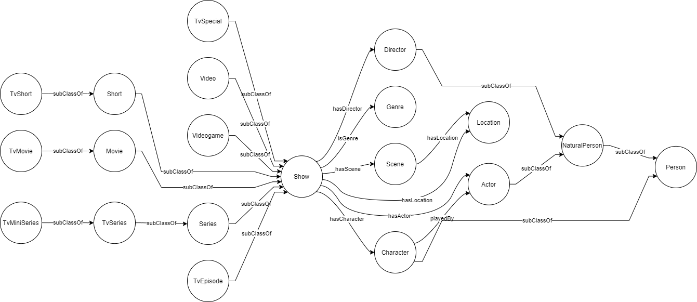

# Movie Locations

A linked data ontology about movies and their filming locations with an accompanying application. Built as a project for the course Knowledge and Data @ Vrije Universiteit Amsterdam.

## Ontology

The populated ontology (linked data) can be found at [`ontology/PopulatedOntology.ttl`](ontology/PopulatedOntology.ttl). Its unpopulated or *clean* version is at [`ontology/CleanOntology.ttl`](ontology/CleanOntology.ttl). For any further explanation about the ontology itself it is best to refer to its relevant [general documentation](ontology/README.md) or [inferences documentation](ontology/INFERENCES.md).

In short this project uses IMDB data to populate the ontology alongside latitudes and longitudes of locations and specific scenes. The image below provides an overview of the data and its links.

## Running the application

### Using the ontology

Any triple store that exposes a SPARQL endpoint and supports `OWL2 RL` inferencing can be used, e.g. [GraphDB](https://graphdb.ontotext.com/). Load [`PopulatedOntology.ttl`](ontology/PopulatedOntology.ttl) into a new repository and let the reasoner run.

In GraphDB this is done by:
1. Setup > Repositories > Create new repository.
2. Give the repository a recognizable ID.
3. Set the ruleset to either `OWL2-RL` or `OWL2-RL (Optimized)`.
4. Click `Create` to create the repository.
5. Open Import > RDF.
6. Upload the `PopulatedOntology.ttl` and import this.
7. Let the import finish.
8. Copy the repository URL to your clipboard, this will later be used.

The resulting repository should contain about 650 thousand explicit statements and 1,4 million inferred statements.

### Running the application

To ensure you can run the application install its dependencies. A requirements file can be found in the application folder. From `\application\` run `pip install -r requirements.txt`.

> Note: Two `requirements.txt` files exist. The file in the root folder can be installed if anything else other than the actual application needs to be ran. The requirements file in the application folder contain the requirements that are necessary for the application only.

With the requirements installed you can run `streamlit run movieLocator.py` from the application folder and the application will launch. If a browser does not automatically open then manually open the link provided in the terminal.

With the URL open an input field should appear where the endpoint of the triple store can be pasted. When this is done without errors the application is ready to be used.

When the endpoint is set and verified the URL is stored in `config.ini`. If this needs changing then either edit it directly in this file or delete it entirely.
