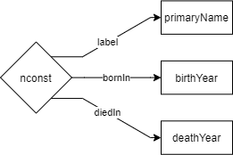
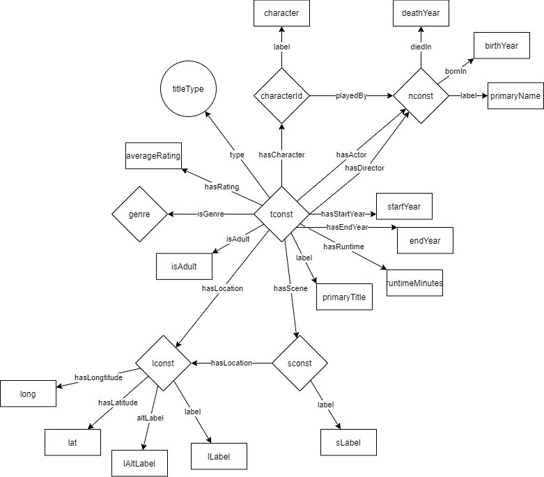

- [Explaination of converted data files](#explaination-of-converted-data-files)
  - [actor_map](#actor_map)
  - [character](#character)
  - [director_map](#director_map)
  - [genre_map](#genre_map)
  - [person](#person)
  - [show](#show)
  - [Overview](#overview)

# Explaination of converted data files

## actor_map

[Sample](actor_map_sample.csv)

This table maps actors to a show. A show can have **multiple** actors. This table appears limited because **only the actors for who their character in the show is unknown appear in this table.** Further information of each specific actor is added to the ontology through the [person](#person) table.

| Column | Meaning                        |
| :----- | :----------------------------- |
| tconst | Identifier of a show           |
| nconst | Identifier of an actor/actress |

## character

[Sample](character_sample.csv)

This table adds characters and their actors to a show. A show can have **multiple** characters. It's important to note that **these actors are not to be added directly to the show**. This should be through inference instead. Further information of each specific actor is added to the ontology through the [person](#person) table.

| Column      | Meaning                        |
| :---------- | :----------------------------- |
| tconst      | Identifier of a show           |
| nconst      | Identifier of an actor/actress |
| character   | Character name                 |
| characterId | Identifier of a character      |

## director_map

[Sample](director_map_sample.csv)

This table maps directors to a show. A show can have **multiple** directors. Further information of each specific director is added to the ontology through the [person](#person) table.

| Column | Meaning                  |
| :----- | :----------------------- |
| tconst | Identifier of a show     |
| nconst | Identifier of a director |

## genre_map

[Sample](genre_map_sample.csv)

This table maps genres to a show. A show can have **multiple** genres.

| Column | Meaning               |
| :----- | :-------------------- |
| tconst | Identifier of a show  |
| genre  | Identifier of a genre |

## person

[Sample](person_sample.csv)

This table adds information to every person.

| Column      | Meaning                |
| :---------- | :--------------------- |
| nconst      | Identifier of a person |
| primaryName | Name of a person       |
| birthYear   | Year person was born   |
| deathYear   | Year person has died   |

## show

[Sample](show_sample.csv)

This table adds information to every show.

| Column        | Meaning                                           |
| :------------ | :------------------------------------------------ |
| tconst        | Identifier of a show                              |
| titleType     | Identifier of the showtype                        |
| primaryTitle  | Name of a show                                    |
| isAdult       | Whether the show is for adults only               |
| startYear     | The release year for movies/start year for series |
| endYear       | The end year of series                            |
| runimeMinutes | Length of show in minutes                         |
| averageRating | Average rating of a show *(0-10)*                 |

## Overview

