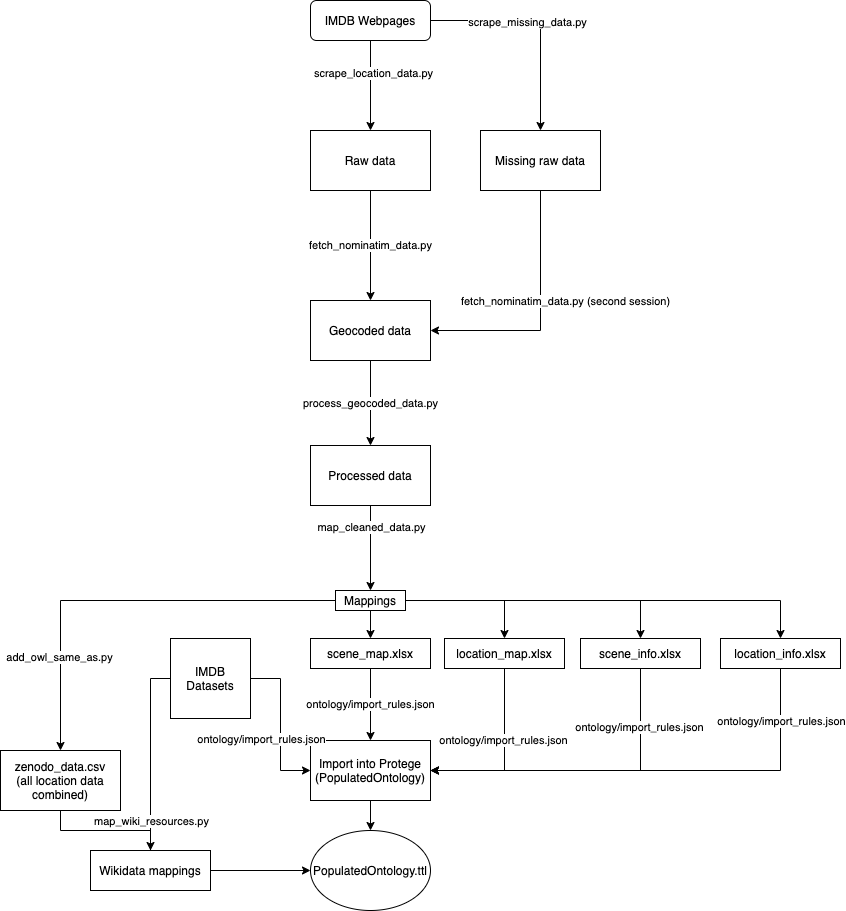

- [IMDB Data](#imdb-data)
- [Location Data](#location-data)
  - [Explanation of location data gathering process](#explanation-of-location-data-gathering-process)
    - [Scraping](#scraping)
    - [Geocoding](#geocoding)
    - [Proces and clean data](#proces-and-clean-data)
    - [Create maps for ontology](#create-maps-for-ontology)
    - [Loading data into the ontology](#loading-data-into-the-ontology)
    - [Adding alignment with Wikidata resource URI's](#adding-alignment-with-wikidata-resource-uris)
  - [Explanation of converted data files](#explanation-of-converted-data-files)
    - [scene_map](#scene_map)
    - [location_map](#location_map)
    - [scene_info](#scene_info)
    - [location_info](#location_info)
    - [zenodo_data](#zenodo_data)
    - [Overview](#overview)

# IMDB Data

# Location Data

## Explanation of location data gathering process

The process of gathering the locations for the shows consisted of several steps. The steps are: Scraping, Geocoding, Processing & cleaning, Creating maps and finally loading the data into protege.

The proces from internet pages for scenes and locations to an ontology can be visualized as follows:

### Scraping

The IMDB datasets **did not provide scenes and locations** for shows so we built a scraper to collect this data ourselves. This was done using the scrape_location_data.py script. After we had our first prototype functioning we found out that some scenes were missing. The scraper had accidentally only scraped odd rows and not even rows. A new scraper script was missing to only scrape for the data that was missing so that not everything had to be scraped again and geocoded again. The scrape_missing_data.py scraped all locations and scenes that were not included yet in our data. As such **the scraping step was done twice**. The second time for the missed scenes. Every step following this step was also done twice, now with the additional data from the missed scenes.

### Geocoding

While we had strings of locations and strings of scenes for titles these **location strings** did not yet have any connection to **"real" locations with longitudes and latitudes**. The fetch_nominatim_data.py script was created. This script fetched the coordinates for our locations by geocding them. Running on one computer this would have taken 24 hours so we made a script that automatically divided the workload over our four computers. Every person of the group ran this script simulteneously geocoding the location strings to locations with real latitudes and longitudes. All other geocoding API's were checked but didn't provide the service we needed on either scale, functionality or pricing.

### Proces and clean data

We now had data for scenes with actual locations and their longitudes and latitudes. The process_geocoded_data.py script **cleaned and processed** this data by giving columns appropriate names, removing special characters among other cleaning operations.

### Create maps for ontology

The fourth step was **creating several excel datasets** that could be loaded into protege with some easy rules. The cleaned, geocoded data was split in four excel dataset. More information on this can be found in the [explanation of converted data files](#explanation-of-converted-data-files).

### Loading data into the ontology

The final step was loading the data of our several processed datasets into protege using the cellfie plugin. The rules that were used for loading the data into protege can be found in [the import rules for the ontology](../ontology/import_rules/actor_map.json).

### Adding alignment with Wikidata resource URI's

An additional step was further postprocessing the data to include a column indicating a wikidata resource. With this column our data was aligned to external RF data on the web. This also allowed for great reuse of our data for future users. This mapping was done via the add_owl_same_as.py script. In this script we queried wikidata for sections of 80 shows and saved the resources that were returned. For more information on this dataset see [zenodo_data](##zenodo_data).

## Explanation of converted data files

### scene_map

[Sample](converted_data/samples/scene_map_sample.csv)

This table maps scenes to a show. A show can have **multiple** scenes. Further information of each specific scene is added to the ontology through the [scene_info](#scene_info) table.

| Column | Meaning               |
| :----- | :-------------------- |
| tconst | Identifier of a show  |
| sconst | Identifier of a scene |

### location_map

[Sample](converted_data/samples/location_map_sample.csv)

This table maps locations to a show. **It only maps locations to shows if there was no scene for this location**. Locations for a scene were mapped to their respective scene. A show can have **multiple** locations. Further information of each specific location is added to the ontology through the [location_info](#location_info) table.

| Column | Meaning                  |
| :----- | :----------------------- |
| tconst | Identifier of a show     |
| lconst | Identifier of a location |

### scene_info

[Sample](converted_data/samples/scene_info_sample.csv)

This table contains the scene identifier and it's attributes. A scene has a label and a location identifier as attributes. More information about locations can be found in the [location_info](#location_info).

| Column | Meaning                                     |
| :----- | :------------------------------------------ |
| sconst | Identifier of a scene                       |
| lconst | ID of the location where the scene was shot |
| sLabel | IMDB label for the scene                    |

### location_info

[Sample](converted_data/samples/location_info_sample.csv)

This table contains the location identifier and it's attributes. A location has a label, alternative label, longitude and latitude. The alternative label is the original lable mentione don IMDB. The default label is the geocoded location from nominatim.

| Column    | Meaning                   |
| :-------- | :------------------------ |
| lconst    | Identifier of a location  |
| lLabel    | Default geocoded label    |
| lAltLabel | Alternative IMDB label    |
| lat       | Latitude of the location  |
| long      | Longitude of the location |

### zenodo_data

This file contains the data of all the previously mentioned datasets combined. It also has an additional column for **wikidata_entry** which maps each of our items to a wikidata resource. This greatly improves reusability for our dataset since it aligns the data to resources on the web. This dataset was created by the additional step of aligning with Wikidata resource URI's. This dataset was merged into our ontology in the final step. This ontology was

| Column         | Meaning                                                               |
| :------------- | :-------------------------------------------------------------------- |
| tconst         | Identifier of a show                                                  |
| sconst         | Identifier of a scene                                                 |
| sLabel         | IMDB label for the scene                                              |
| lconst         | Identifier of a location                                              |
| lLabel         | Default geocoded label                                                |
| lAltLabel      | Alternative IMDB label                                                |
| lat            | Latitude of the location                                              |
| long           | Longitude of the location                                             |
| rowconst       | Identifier for every unique combination of title, scene and location  |
| wikidata_entry | Url to a wikidata entity which is the same as the tconst (owl:sameAs) |

### Overview

