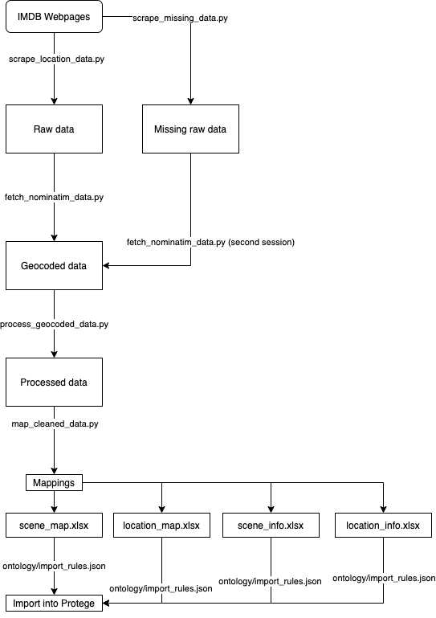

- [Explanation of location data gathering process](#explanation-of-location-data-gathering-process)
  - [Scraping](#scraping)
  - [Geocoding](#geocoding)
  - [Proces and clean data](#proces-and-clean-data)
  - [Create maps for ontology](#create-maps-for-ontology)
- [Explanation of converted data files](#explanation-of-converted-data-files)
  - [scene_map](#scene_map)
  - [location_map](#location_map)
  - [scene_info](#scene_info)
  - [location_info](#location_info)
  - [Overview](#overview)
- [Other](#other)
    - [Old notes](#old-notes)

# Explanation of location data gathering process

The process of gathering the locations for the shows consisted of several steps. The steps are: Scraping, Geocoding, Processing & cleaning, Creating maps and finally loading the data into protege.

The proces from internet pages for scenes and locations to an ontology can be visualized as follows:

## Scraping

The IMDB datasets **did not provide scenes and locations** for shows so we built a scraper to collect this data ourselves. This was done using the scrape_location_data.py script. After we had our first prototype functioning we found out that some scenes were missing. The scraper had accidentally only scraped odd rows and not even rows. A new scraper script was missing to only scrape for the data that was missing so that not everything had to be scraped again and geocoded again. The scrape_missing_data.py scraped all locations and scenes that were not included yet in our data. As such **the scraping step was done twice**. The second time for the missed location. Every step following this step was also done twice, now with the new data.

## Geocoding

While we had strings of locations and strings of scenes for titles these **location strings** did not yet have any connection to **"real" locations with longitudes and latitudes**. The fetch_nominatim_data.py script was created. Every person of the group ran this script simulteneously geocoding the location strings to locations with real latitudes and longitudes. All other API's were checked but didn't provide the service we needed.

## Proces and clean data

We now had data for scenes with actual locations and their longitudes and latitudes. The process_geocoded_data.py script **cleaned and processed** this data by giving columns appropriate names, removing special characters among other cleaning operations.

## Create maps for ontology

The final step was c**reating several excel datasets** that could be loaded into protege with some easy rules. The cleaned, geocoded data was split in four excel dataset. More information on this can be found in the [explanation of converted data files](#explanation-of-converted-data-files).

# Explanation of converted data files

## scene_map

[Sample](converted_data/samples/scene_map_sample.csv)

This table maps scenes to a show. A show can have **multiple** scenes. Further information of each specific scene is added to the ontology through the [scene_info](#scene_info) table.

| Column | Meaning               |
| :----- | :-------------------- |
| tconst | Identifier of a show  |
| sconst | Identifier of a scene |

## location_map

[Sample](converted_data/samples/location_map_sample.csv)

This table maps locations to a show. **It only maps locations to shows if there was no scene for this location**. Locations for a scene were mapped to their respective scene. A show can have **multiple** locations. Further information of each specific location is added to the ontology through the [location_info](#location_info) table.

| Column | Meaning                  |
| :----- | :----------------------- |
| tconst | Identifier of a show     |
| lconst | Identifier of a location |

## scene_info

[Sample](converted_data/samples/scene_info_sample.csv)

This table contains the scene identifier and it's attributes. A scene has a label and a location identifier as attributes. More information about locations can be found in the [location_info](#location_info).

| Column | Meaning                                     |
| :----- | :------------------------------------------ |
| sconst | Identifier of a scene                       |
| lconst | ID of the location where the scene was shot |
| sLabel | IMDB label for the scene                    |

## location_info

[Sample](converted_data/samples/location_info_sample.csv)

This table contains the location identifier and it's attributes. A location has a label, alternative label, longitude and latitude. The alternative label is the original lable mentione don IMDB. The default label is the geocoded location from nominatim.

| Column    | Meaning                   |
| :-------- | :------------------------ |
| lconst    | Identifier of a location  |
| lLabel    | Default geocoded label    |
| lAltLabel | Alternative IMDB label    |
| lat       | Latitude of the location  |
| long      | Longitude of the location |

## Overview

# Other

### Old notes

9/10: All you need to do is run the fetch_nominatim_data.py install the dependencies and enter your number. You can stop the program, when you start it again it will take off at the file where it stopped.

8/10: I have checked a lot of services and they all have their drawbacks in price, availability, etc. So we will do the proposed split of the raw_location_data in four parts where all four of us run the nominatim_fetcher included in this folder.

7/10: We have around 75000 locations for 30000 movies after removing studios.

GeoCoding might be an issue. Open API's such as Nominatim work very well but discourage bulk and prefer max. 1 request per second.

- I have temporarily used the usadress library to parse the locations to categories that might be helpful in getting the lat and long via dbPedia. There are other parsing libraries. Of the three that I tried this one was the best but not good enough.

- Alternatively we can reuest Geocoding from Nominatim on the fly in our website interface. Then it only has to code the locations that come from the filters.

- Alternatively, we can look into some API that allows bulk geocoding for free for a max. amount of requests. I.e. after registering 10000 queries for free.
