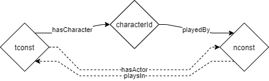
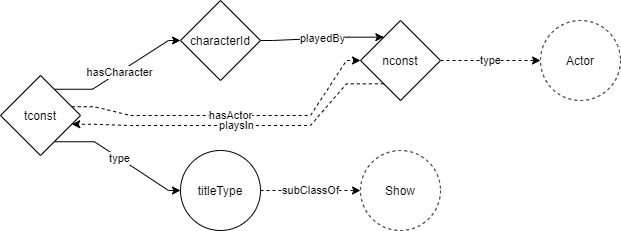
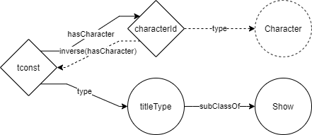

- [Inferences](#inferences)
  - [Properties](#properties)
    - [directs](#directs)
    - [hasActor](#hasactor)
    - [hasCharacter](#hascharacter)
    - [hasDirector](#hasdirector)
    - [hasLocation](#haslocation)
    - [hasScene](#hasscene)
    - [isCharacterIn](#ischaracterin)
    - [isGenre](#isgenre)
    - [isGenreOf](#isgenreof)
    - [isLocationOf](#islocationof)
    - [isSceneOf](#issceneof)
    - [playsIn](#playsin)
  - [Classes](#classes)
    - [Actor](#actor)
    - [Character](#character)
    - [Director](#director)
    - [Scene](#scene)
    - [Location](#location)
    - [Genre](#genre)
  - [Overview](#overview)

# Inferences

## Properties

### directs

```
ObjectProperty: ml:directs
    InverseOf: 
        ml:hasDirector
 ``` 

### hasActor

```
ObjectProperty: ml:hasActor
    SubPropertyChain: 
        ml:hasCharacter o ml:playedBy
    InverseOf: 
        ml:playsIn
```



### hasCharacter

``` 
ObjectProperty: ml:hasCharacter
    InverseOf: 
        ml:isCharacterIn
```

### hasDirector

```    
ObjectProperty: ml:hasDirector
    InverseOf: 
        ml:directs
```

### hasLocation

```    
ObjectProperty: ml:hasLocation
    SubPropertyChain: 
        ml:hasScene o ml:hasLocation
    InverseOf: 
        ml:isLocationOf
```

### hasScene

```    
ObjectProperty: ml:hasScene
    InverseOf: 
        ml:isSceneOf
```

### isCharacterIn

```    
ObjectProperty: ml:isCharacterIn
    InverseOf: 
        ml:hasCharacter
```

### isGenre

```    
ObjectProperty: ml:isGenre
    InverseOf: 
        ml:isGenreOf
```

### isGenreOf

```    
ObjectProperty: ml:isGenreOf
    InverseOf: 
        ml:isGenre
```

### isLocationOf

```
ObjectProperty: ml:isLocationOf
    InverseOf: 
        ml:hasLocation
```

### isSceneOf

```    
ObjectProperty: ml:isSceneOf
    InverseOf: 
        ml:hasScene
```

### playsIn

```    
ObjectProperty: ml:playsIn
    InverseOf: 
        ml:hasActor
```

## Classes

It's important to understand that all classes will be inferred knowledge. Except for the specific title/show. These will be the only individuals which are explicitly stated to be of a class.

So every title will be an inidivual of one of the following classes:
- Show
  - Short
    - TvShort
  - Movie
    - TvMovie
  - Series
    - TvSeries
      - TvMiniSeries
  - TvEpisode
  - TvSpecial
  - Video
  - VideoGame


### Actor

```
Class: ml:Actor
    EquivalentTo: 
        ml:playsIn some ml:Show
```



### Character

```
Class: ml:Character
    EquivalentTo: 
        ml:isCharacterIn some ml:Show
```




### Director

```
Class: ml:Director
    EquivalentTo: 
        ml:directs some ml:Show
```

### Scene

```
Class: ml:Scene
    EquivalentTo: 
        ml:isSceneOf some ml:Show

```

### Location

```
Class: ml:Location
    EquivalentTo: 
        ml:isLocationOf some ml:Show

```

### Genre

```
Class: ml:Genre
    EquivalentTo: 
        ml:isGenreOf some ml:Show
```

## Overview

Overview of inferred knowledge. The dotted lines represent the inferred knowledge. The solid lines are explicit statements that are used to derive inference.

