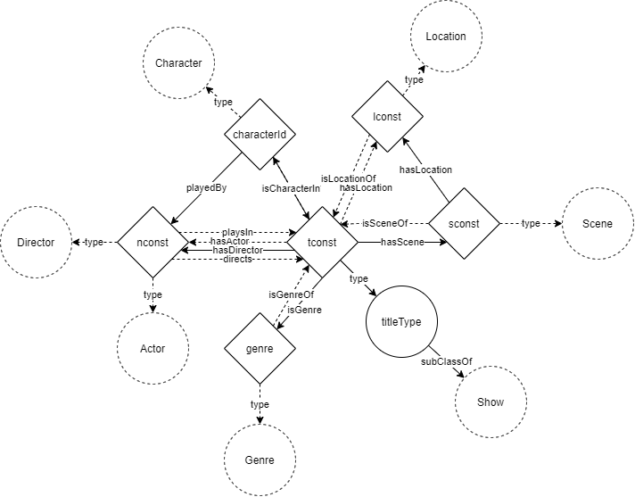

Markdown documentation created by [pyLODE](http://github.com/rdflib/pyLODE) 2.8.3

# Movie Locations

## Metadata
* **URI**
  * `http://example.com/movieLocations/`
* **Ontology RDF**
  * RDF ([.\CleanOntology.ttl](turtle))

## Table of Contents
1. [Classes](#classes)
1. [Object Properties](#object-properties)
1. [Datatype Properties](#datatype-properties)
1. [Namespaces](#namespaces)
1. [Legend](#legend)

## Overview

**Figure 1:** Ontology overview

## Classes
[Actor](#Actor),
[Character](#Character),
[Director](#Director),
[Genre](#Genre),
[Location](#Location),
[Movie](#Movie),
[Movie](#Movie1),
[NaturalPerson](#NaturalPerson),
[Person](#Person),
[Person](#Person1),
[Scene](#Scene),
[Series](#Series),
[Short](#Short),
[Show](#Show),
[TvEpisode](#TvEpisode),
[TvMiniSeries](#TvMiniSeries),
[TvMovie](#TvMovie),
[TvSeries](#TvSeries),
[TvSeries](#TvSeries1),
[TvShort](#TvShort),
[TvSpecial](#TvSpecial),
[Video](#Video),
[VideoGame](#VideoGame),
### Actor
Property | Value
--- | ---
URI | `http://example.com/movieLocations/Actor`
Super-classes |[ml:NaturalPerson](http://example.com/movieLocations/NaturalPerson) (c) 
### Character
Property | Value
--- | ---
URI | `http://example.com/movieLocations/Character`
Super-classes |[ml:Person](http://example.com/movieLocations/Person) (c) 
### Director
Property | Value
--- | ---
URI | `http://example.com/movieLocations/Director`
Super-classes |[ml:NaturalPerson](http://example.com/movieLocations/NaturalPerson) (c) 
### Genre
Property | Value
--- | ---
URI | `http://example.com/movieLocations/Genre`
### Location
Property | Value
--- | ---
URI | `http://example.com/movieLocations/Location`
### Movie
Property | Value
--- | ---
URI | `http://example.com/movieLocations/Movie`
Super-classes |[ml:Show](http://example.com/movieLocations/Show) (c) 
Sub-classes |[ml:TvMovie](http://example.com/movieLocations/TvMovie) (c) 
### NaturalPerson
Property | Value
--- | ---
URI | `http://example.com/movieLocations/NaturalPerson`
Super-classes |[ml:Person](http://example.com/movieLocations/Person) (c) 
Sub-classes |[ml:Director](http://example.com/movieLocations/Director) (c) [ml:Actor](http://example.com/movieLocations/Actor) (c) 
### Person
Property | Value
--- | ---
URI | `http://example.com/movieLocations/Person`
Sub-classes |[ml:Character](http://example.com/movieLocations/Character) (c) [ml:NaturalPerson](http://example.com/movieLocations/NaturalPerson) (c) 
### Scene
Property | Value
--- | ---
URI | `http://example.com/movieLocations/Scene`
### Series
Property | Value
--- | ---
URI | `http://example.com/movieLocations/Series`
Super-classes |[ml:Show](http://example.com/movieLocations/Show) (c) 
Sub-classes |[ml:TvSeries](http://example.com/movieLocations/TvSeries) (c) 
### Short
Property | Value
--- | ---
URI | `http://example.com/movieLocations/Short`
Super-classes |[ml:Show](http://example.com/movieLocations/Show) (c) 
Sub-classes |[ml:TvShort](http://example.com/movieLocations/TvShort) (c) 
### Show
Property | Value
--- | ---
URI | `http://example.com/movieLocations/Show`
Sub-classes |[ml:Short](http://example.com/movieLocations/Short) (c) [ml:TvSpecial](http://example.com/movieLocations/TvSpecial) (c) [ml:Video](http://example.com/movieLocations/Video) (c) [ml:Movie](http://example.com/movieLocations/Movie) (c) [ml:VideoGame](http://example.com/movieLocations/VideoGame) (c) [ml:Series](http://example.com/movieLocations/Series) (c) [ml:TvEpisode](http://example.com/movieLocations/TvEpisode) (c) 
### TvEpisode
Property | Value
--- | ---
URI | `http://example.com/movieLocations/TvEpisode`
Super-classes |[ml:Show](http://example.com/movieLocations/Show) (c) 
### TvMiniSeries
Property | Value
--- | ---
URI | `http://example.com/movieLocations/TvMiniSeries`
Super-classes |[ml:TvSeries](http://example.com/movieLocations/TvSeries) (c) 
### TvMovie
Property | Value
--- | ---
URI | `http://example.com/movieLocations/TvMovie`
Super-classes |[ml:Movie](http://example.com/movieLocations/Movie) (c) 
### TvSeries
Property | Value
--- | ---
URI | `http://example.com/movieLocations/TvSeries`
Super-classes |[ml:Series](http://example.com/movieLocations/Series) (c) 
Sub-classes |[ml:TvMiniSeries](http://example.com/movieLocations/TvMiniSeries) (c) 
### TvShort
Property | Value
--- | ---
URI | `http://example.com/movieLocations/TvShort`
Super-classes |[ml:Short](http://example.com/movieLocations/Short) (c) 
### TvSpecial
Property | Value
--- | ---
URI | `http://example.com/movieLocations/TvSpecial`
Super-classes |[ml:Show](http://example.com/movieLocations/Show) (c) 
### Video
Property | Value
--- | ---
URI | `http://example.com/movieLocations/Video`
Super-classes |[ml:Show](http://example.com/movieLocations/Show) (c) 
### VideoGame
Property | Value
--- | ---
URI | `http://example.com/movieLocations/VideoGame`
Super-classes |[ml:Show](http://example.com/movieLocations/Show) (c) 
### Movie
Property | Value
--- | ---
URI | `http://schema.org/Movie`
### TvSeries
Property | Value
--- | ---
URI | `http://schema.org/TvSeries`
### Person
Property | Value
--- | ---
URI | `http://xmlns.com/foaf/0.1/Person`

## Object Properties
[directs](#directs),
[hasActor](#hasActor),
[hasCharacter](#hasCharacter),
[hasDirector](#hasDirector),
[hasLocation](#hasLocation),
[hasScene](#hasScene),
[isCharacterIn](#isCharacterIn),
[isGenre](#isGenre),
[isGenreOf](#isGenreOf),
[isLocationOf](#isLocationOf),
[isSceneOf](#isSceneOf),
[playedBy](#playedBy),
[playsIn](#playsIn),
[actor](#actor),
[character](#character),
[director](#director),

### directs
Property | Value
--- | ---
URI | `http://example.com/movieLocations/directs`

### hasActor
Property | Value
--- | ---
URI | `http://example.com/movieLocations/hasActor`

### hasCharacter
Property | Value
--- | ---
URI | `http://example.com/movieLocations/hasCharacter`

### hasDirector
Property | Value
--- | ---
URI | `http://example.com/movieLocations/hasDirector`

### hasLocation
Property | Value
--- | ---
URI | `http://example.com/movieLocations/hasLocation`

### hasScene
Property | Value
--- | ---
URI | `http://example.com/movieLocations/hasScene`

### isCharacterIn
Property | Value
--- | ---
URI | `http://example.com/movieLocations/isCharacterIn`

### isGenre
Property | Value
--- | ---
URI | `http://example.com/movieLocations/isGenre`

### isGenreOf
Property | Value
--- | ---
URI | `http://example.com/movieLocations/isGenreOf`

### isLocationOf
Property | Value
--- | ---
URI | `http://example.com/movieLocations/isLocationOf`

### isSceneOf
Property | Value
--- | ---
URI | `http://example.com/movieLocations/isSceneOf`

### playedBy
Property | Value
--- | ---
URI | `http://example.com/movieLocations/playedBy`

### playsIn
Property | Value
--- | ---
URI | `http://example.com/movieLocations/playsIn`

### actor
Property | Value
--- | ---
URI | `http://schema.org/actor`

### character
Property | Value
--- | ---
URI | `http://schema.org/character`

### director
Property | Value
--- | ---
URI | `http://schema.org/director`

## Datatype Properties
[bornIn](#bornIn),
[diedIn](#diedIn),
[hasEndYear](#hasEndYear),
[hasFullName](#hasFullName),
[hasLatitude](#hasLatitude),
[hasLongitude](#hasLongitude),
[hasPrimaryTitle](#hasPrimaryTitle),
[hasRating](#hasRating),
[hasRuntime](#hasRuntime),
[hasSceneName](#hasSceneName),
[hasStartYear](#hasStartYear),
[isAdult](#isAdult),

### bornIn
Property | Value
--- | ---
URI | `http://example.com/movieLocations/bornIn`

### diedIn
Property | Value
--- | ---
URI | `http://example.com/movieLocations/diedIn`

### hasEndYear
Property | Value
--- | ---
URI | `http://example.com/movieLocations/hasEndYear`

### hasFullName
Property | Value
--- | ---
URI | `http://example.com/movieLocations/hasFullName`

### hasLatitude
Property | Value
--- | ---
URI | `http://example.com/movieLocations/hasLatitude`

### hasLongitude
Property | Value
--- | ---
URI | `http://example.com/movieLocations/hasLongitude`

### hasPrimaryTitle
Property | Value
--- | ---
URI | `http://example.com/movieLocations/hasPrimaryTitle`

### hasRating
Property | Value
--- | ---
URI | `http://example.com/movieLocations/hasRating`

### hasRuntime
Property | Value
--- | ---
URI | `http://example.com/movieLocations/hasRuntime`

### hasSceneName
Property | Value
--- | ---
URI | `http://example.com/movieLocations/hasSceneName`

### hasStartYear
Property | Value
--- | ---
URI | `http://example.com/movieLocations/hasStartYear`

### isAdult
Property | Value
--- | ---
URI | `http://example.com/movieLocations/isAdult`

## Named Individuals
## Namespaces
* **foaf**
  * `http://xmlns.com/foaf/0.1/`
* **ml**
  * `http://example.com/movieLocations/`
* **owl**
  * `http://www.w3.org/2002/07/owl#`
* **prov**
  * `http://www.w3.org/ns/prov#`
* **rdf**
  * `http://www.w3.org/1999/02/22-rdf-syntax-ns#`
* **rdfs**
  * `http://www.w3.org/2000/01/rdf-schema#`
* **schema**
  * `http://schema.org/`
* **sdo**
  * `https://schema.org/`
* **skos**
  * `http://www.w3.org/2004/02/skos/core#`
* **xsd**
  * `http://www.w3.org/2001/XMLSchema#`

## Legend
* Classes: c
* Object Properties: op
* Functional Properties: fp
* Data Properties: dp
* Annotation Properties: dp
* Properties: p
* Named Individuals: ni